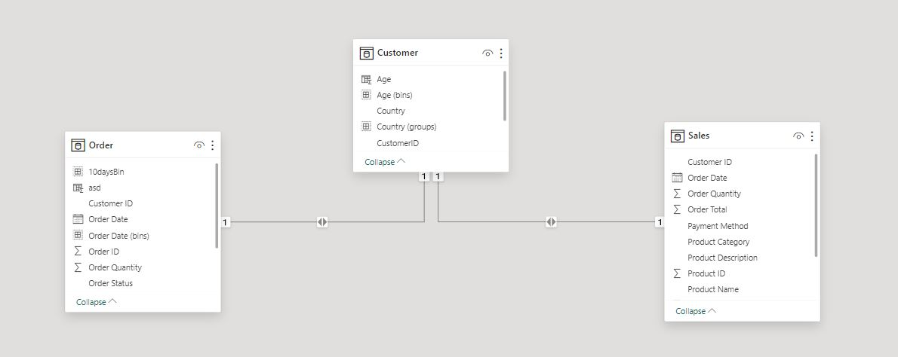
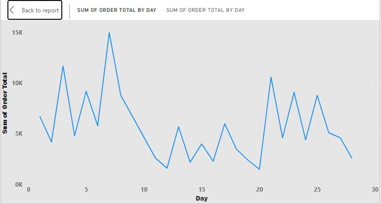
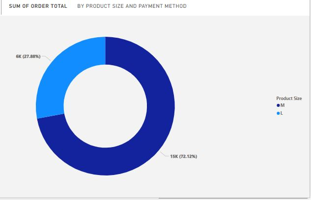
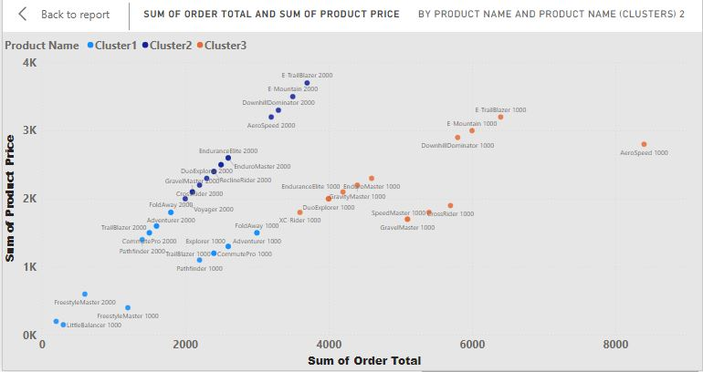
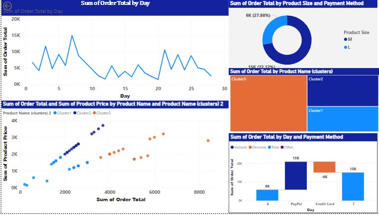

# Microsoft Power BI Analyzer Feature Sales Analysis 
  ## Avanture Work: Bike Company  

## INTRODUCTION
In this portfolio project, I delve into _Power BI's Analyze feature_, showcasing its capabilities through real-world data examples and analysis scenarios. From data exploration to insightful visualizations, 
this project aims to demonstrate the transformative potential of advanced data analysis in driving actionable insights and informed decision-making.

**Specifically, I am**:
- Using clustering in a Scatter chart to add product clusters that assist the Analyze feature.
- Creating a Line chart from the sales figures to identify dates with sales surges, then using the Analyze feature to detect the reasons behind these increases.
- Incorporating all relevant visualizations derived from the insights generated by the 'Explain the Increase' tool within Power BI.

## Skills and Concepts Demonstrated:
The following Power BI features where incorporated:
-	Filters
-	Visuals
-	Formatting
-	Page navigation
-	Modeling
-	Slicer buttons
## KEY BUSINESS QUESTIONS TO ADDRESS:
1.	Identifying significant dates with spikes in sales activity.
2.	Analyzing reasons behind price surges using Power BI's Analyzer features.

## Data Source:

The data for this project is sourced from a Power BI report file named "Adventure Works Sales Report.pbix," obtained during a course exercise on Power BI.

## Data Cleaning and Preparation:
The dataset used in this project has not undergone pre-cleaning as it is already in a cleaned format.

## DATA MODELING:
In data modeling, an automatic star schema is utilized, where two-dimensional tables such as sales and orders are linked to a central fact table (customer).

## RESULT AND INTERPRETATION: The analysis results are summarized as follow :-

## Visualization:

1.	Line Chart Analysis: Identified significant surges in sales on the 3rd and 7th of March.
   
   
    
  	
   
3.	Donut Chart Analysis: Showed that median-sized products accounted for 72.12% of the increase.
   
   
    
  	
   
5.	Cluster Chart: Categorized products based on order totals and prices.
   
    
  	
  	
    ## Dashboard
   
   
     

## Insights from Analysis:

 
    
1.	Factors contributing to surges on the 3rd and 7th of March include product size (median) and payment method (PayPal).
2.	Cluster 3 showed higher order totals and product prices.
   
## CONCLUSION:

   Leveraging Power BI's Analyze features, this project successfully investigated the unexpected surge in Adventure Works' sales figures. Key findings include the impact of product size and payment methods on sales increases.

## RECOMMENDATION:

Base on the analysis, we recommend the following: 

1.	Further analysis could delve into specific product categories or seasonal trends to gain deeper insights. 
2.	Exploring correlations with demographics, product categories, or promotions may also provide valuable insights.

